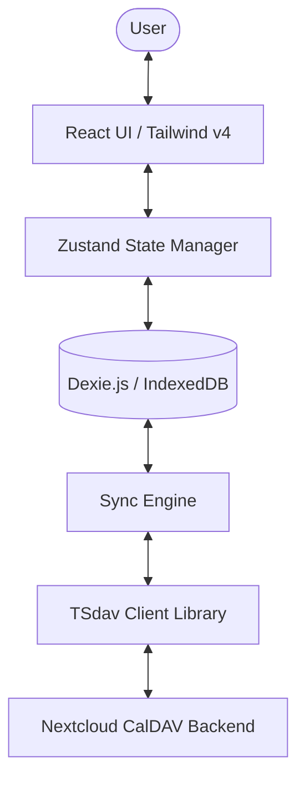

# Architecture Documentation - Personal Calendar & Todo Client

This document outlines the architectural decisions, design patterns, and tech stack choices for the client-side SPA personal calendar and todo application.

---

## 1. System Overview

The application is a pure client-side Single Page Application (SPA) designed to interface directly with a self-hosted Nextcloud CalDAV server. It implements an **offline-first** architecture, caching all calendar events and tasks locally in the browser to ensure high performance and offline availability.



---

## 2. Technology Stack & Design Decisions

### 2.1 Core Framework: React (TypeScript)
* **Choice**: React 18+ with Vite.
* **Why**:
  * React's component model fits the interactive calendar grid layout (monthly, weekly views).
  * High compatibility with AI code generation tools due to extensive training data representation.
  * TypeScript enforces contract safety between the local database models and server payloads.

### 2.2 Styling: Tailwind CSS v4
* **Choice**: Tailwind CSS v4.
* **Why**:
  * Out-of-the-box performance improvements with lightningcss.
  * Simplified configuration (CSS-based imports instead of a separate config file).
  * Eliminates custom CSS management, making component styling self-contained and easy for AI agents to edit/adjust.

### 2.3 Offline Database: Dexie.js (IndexedDB)
* **Choice**: Dexie.js.
* **Why**:
  * Calendar apps require filtering records by date ranges (e.g., loading events for August 2026). Dexie simplifies IndexedDB index creation, allowing high-performance range queries.
  * Native transaction support ensures database integrity if a sync fails midway.
  * Lightweight alternative to running SQLite via WASM.

### 2.4 Synchronization Layer: `tsdav`
* **Choice**: `tsdav` library.
* **Why**:
  * CalDAV is WebDAV-based and uses complex XML payloads. Writing a custom parser/generator is highly error-prone.
  * `tsdav` abstracts these XML communications, offering native TypeScript interfaces for fetching, updating, and deleting `VTODO` and `VEVENT` records.

### 2.5 Deployment: Dockerized Caddy Server
* **Choice**: Static build served via `caddy:alpine`.
* **Why**:
  * Simple static serving is all that is required since there is no custom backend.
  * Caddy has automatic HTTPS capability if exposed directly, and is highly performant.
  * Very small image size (~15-20MB container footprint).

---

## 3. Data Synchronization Strategy

To ensure offline functionality and avoid sync conflicts:

1. **Local Reads**: The UI reads only from Dexie.js. It never waits on network requests for rendering.
2. **Synchronization Cycle**:
   * **On Load/Interval**: Sync engine polls Nextcloud via `tsdav` to fetch changes since the last sync anchor.
   * **Local Write**: The UI writes to Dexie.js instantly and queues a sync job.
   * **Background Push**: Sync engine processes the queued job, pushes changes to Nextcloud, and updates the local sync anchor on success.
3. **Conflict Resolution**:
   * Last-write-wins (LWW) based on timestamps is the default strategy for simplicity.

---

## 4. Directory Structure

```text
personal-calendar/
├── src/
│   ├── components/       # UI Components (Calendar, TodoList, etc.)
│   ├── db/               # Dexie.js schema definition and queries
│   ├── sync/             # CalDAV sync engine logic
│   ├── store/            # Zustand state management
│   ├── App.tsx           # Application root
│   ├── main.tsx          # Vite entrypoint
│   └── index.css         # Tailwind v4 directives
├── Dockerfile            # Container configuration
├── package.json
└── tsconfig.json
```
